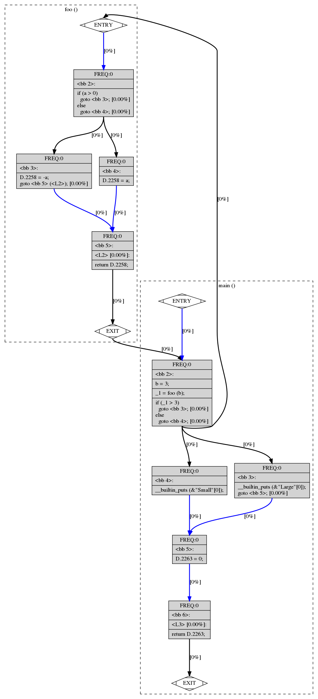

# 14/02/2019

## Récapitulatif

### Tests
Plusieurs répertoire dans Tests/ ont été créés pour comprendre comment se génèrent les graphes.

### Intuitions
On a pu voir qu'il est possible de travailler sur les fichiers dot pour créer nous-même des transitions.
On aimerait bien trouver les docs nous permettant de pouvoir soit changer le code source (solution la moins pratique) soit pouvoir travailler avec un script qu'on écrit sur les cfg et dot pour faire ce qu'on veut.

On aimerait pouvoir relier les fonctions entre elles, et donc pour ça on doit pouvoir créer des nouveaux noeuds qui appellent ces fonctions et un autre qui récupère le résultat(s'il y en a un).

### Plusieurs appels imbriqués de fonction
On a voulu tester ce que ça faisait si on appelait une fonction en lui donnant en paramètre le retour d'une autre fonction pour voir si dans le cfg c'était géré comme des appels successifs, ce qui est bien le cas. Ce qui nous facilite la vie.

### Calculs avec parenthèses
On a aussi testé des calculs avec des parenthèses pour voir si il faisait une opération à la fois dans le cfg ou s'il faisait tout d'un coup. Il fait bien une opération à la fois ce qui nous facilite également la vie.

### Ajout de flèches entre fonctions à la main
On a réussi à créer un nouveau node s'arrêtant à un appel de fonction pour le relier au graphe de la fonction appelée.

## Trucs à faire
- [] réussir à prendre les fonctions qu'on a créé pour relier les fonctions
- [] trouver la doc gcc vers dot