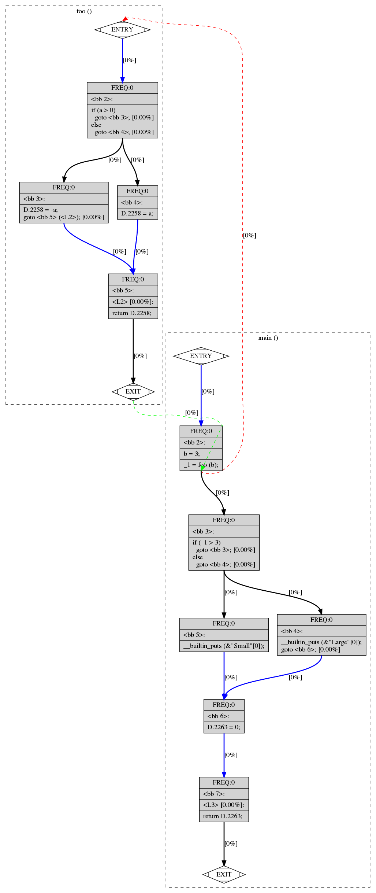

# 14/02/2019

## Récapitulatif

### Tests
Plusieurs répertoire dans Tests/ ont été créés pour comprendre comment se génèrent les graphes.

### Intuitions
On a pu voir qu'il est possible de travailler sur les fichiers dot pour créer nous-même des transitions.
On aimerait bien trouver les docs nous permettant de pouvoir soit changer le code source (solution la moins pratique) soit pouvoir travailler avec un script qu'on écrit sur les cfg et dot pour faire ce qu'on veut.

On aimerait pouvoir relier les fonctions entre elles, et donc pour ça on doit pouvoir créer des nouveaux noeuds qui appellent ces fonctions et un autre qui récupère le résultat(s'il y en a un).

### Plusieurs appels imbriqués de fonction
On a voulu tester ce que ça faisait si on appelait une fonction en lui donnant en paramètre le retour d'une autre fonction pour voir si dans le cfg c'était géré comme des appels successifs, ce qui est bien le cas. Ce qui nous facilite la vie.

### Calculs avec parenthèses
On a aussi testé des calculs avec des parenthèses pour voir si il faisait une opération à la fois dans le cfg ou s'il faisait tout d'un coup. Il fait bien une opération à la fois ce qui nous facilite également la vie.

### Ajout de flèches entre fonctions à la main
On a réussi à créer un nouveau node s'arrêtant à un appel de fonction pour le relier au graphe de la fonction appelée.

## Trucs à faire
- [x] réussir à prendre les fonctions qu'on a créé pour relier les fonctions
- [x] trouver la doc gcc vers dot

# 18/02/2019

## Récapitulatif

### Tests/Try_modelisation

Nous avons modélisé la manière dont nous voulons gérer les fonctions dans le graphe. Nous avons décidé de créer une instruction `call fonction(args)` pour appeler une fonction à partir d'un noeud qui va être relié au noeud entry de cette fonction.

Ensuite la valeur de retour est stockée dans la variable qui était prévu à cet effet comme ceci `_1 = return fonction(args)`.

Voici le résultat:

# 21/02/2019

## Récapitulatif

### Test pydot

On voulait trouver un parser de fichiers dot. On a trouvé la bibliothèque python pydot qui permet d'importer un fichier dot afin de créer une structure de graphe définie par cette bibliothèque afin de travailler sur les objets plutôt que le fichier dot.

Dans le dossier `/Notebooks` on a créé un premier notebook testant cette librairie et on a pu voir qu'il est possible de changer la structure du graphe comme on pouvait le faire à la main pour créer de nouveaux nodes et edges.

Maintenant nous allons devoir parser les labels des nodes pour trouver où sont les fonctions et créer des noeuds et edges en fonction de ce qu'on a trouvé.

### Création du script

On a commencé à créer le script python pour faire des liens entre les fonctions, c'est le deuxième notebook. On continuera le 25/02/2019.

# 25/02/2019

## Récapitualtif
On a continué le script python en faisant beaucoup de regex pour parser les labels, on poursuit le 28/02 ou 01/03.

# 28/02/2019

## Récapitulatif
On a encore continué le script, on a presque fini de créer le nouveau noeud, ensuite il faudra faire les edges quand on aura terminé.

# 3/03/2019

## Récapitulatif

On a fini le script et testé sur différents cas. On merge la branch script et master afin de marquer le coup.

# 11/03/2019

## Récapitualtif
On a cherché comment utiliser networkx pour analyser les graphes: cycle, betweeness, ...

On n'a pas trouvé et décidé de chercher chacun de son côté comment le faire.

# 18/03/2019

## Récapitulatif
On a réussi à construire un graphe networkx à partir d'un graph pydot.

On a aussi extrait deux informations du graphe: les degrés entrants pour chaque noeud ainsi que la betweeness de chaque noeud.

On a évoqué l'idée qu'il faudrait peut-être analyser chaque fonction dans le fichier généré de base par GCC ainsi que le fichier modifié pour pouvoir analyser le programme dans son ensemble ainsi que pour chaque fonction.

## Todo

- [] Trouver des informations à tirer du graph transformé par notre premier script.
- [] Implémenter ces idées.
- [] Noter les idées qui seraient spécifiques à des fonctions.